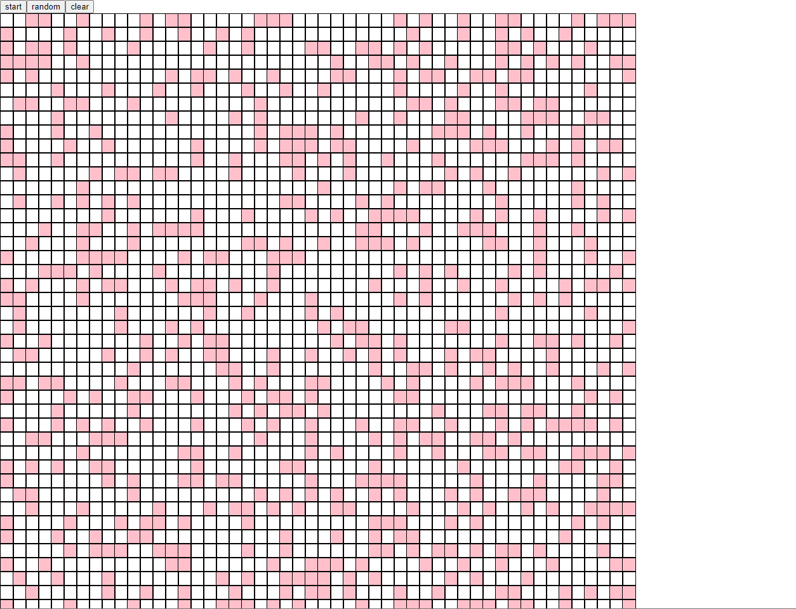

# Game of Life

The Game of Life is a cellular automaton devised by the British mathematician John Conway in 1970. The game is played on a two-dimensional grid of cells, where each cell can be either alive or dead. The game follows a set of rules to determine the state of each cell in the next generation.

Algorithm

The Game of Life algorithm is as follows:

For each cell in the grid:
- If the cell is alive and has fewer than two live neighbors, it dies.
- If the cell is alive and has two or three live neighbors, it lives on to the next generation.
- If the cell is alive and has more than three live neighbors, it dies.
- If the cell is dead and has exactly three live neighbors, it becomes alive.

## Tech stack
- React native
- yarn
